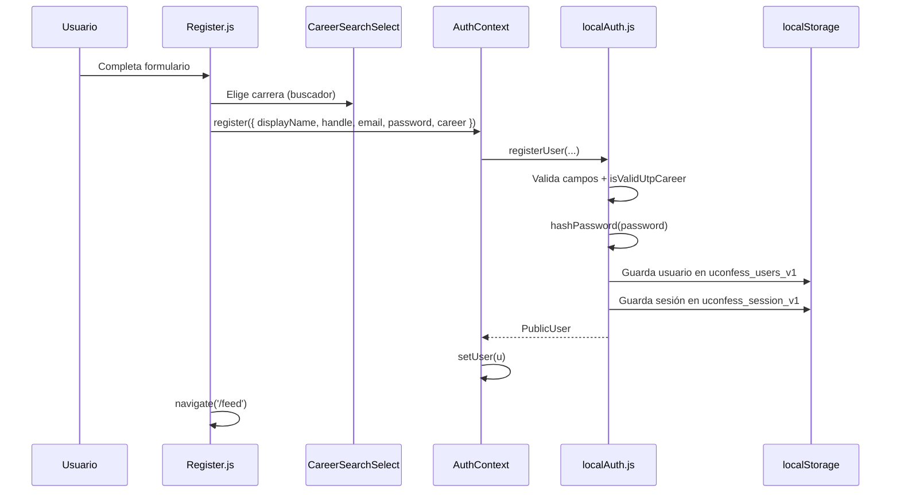

# UConfess — Documentación técnica del proyecto

> **Propósito de este documento:** Explicar el *core* funcional y de diseño de UniConfess_Front para que tú (o otra IA) puedan entender el flujo completo, qué hace cada capa y cómo se conectan los archivos — sin necesidad de leer el código línea por línea al azar.

---

## 1. ¿Qué es este proyecto?

**UConfess** es una aplicación web (SPA) para estudiantes de la **UTP** (Universidad Tecnológica del Perú): una red social ligera donde pueden **publicar confesiones**, **comentar**, dar **me gusta** y **repostear**, usando la identidad de su cuenta (nombre + `@usuario` + carrera).

**Estado actual:** prototipo **frontend-only**. Los datos viven en **`localStorage`** del navegador. Opcionalmente, las publicaciones pueden apuntar a un backend si defines `REACT_APP_API_URL` en un archivo `.env`.

---

## 2. Stack tecnológico

| Tecnología | Uso |
|------------|-----|
| **React 19** | UI por componentes |
| **React Router 7** | Rutas (`/`, `/feed`, `/login`, etc.) |
| **Tailwind CSS 4** | Estilos (clases en JSX, no CSS por página) |
| **Create React App** | Build y servidor de desarrollo |
| **localStorage** | “Base de datos” local (usuarios, sesión, posts, interacciones) |

**Entrada de la app:** `src/index.js` → monta `<App />` en el DOM.  
**Raíz de la app:** `src/App.js` → router, auth global, navbar, rutas, footer condicional.

---

## 3. Idea clave: las *pages* casi no tienen lógica ni diseño “pesado”

Tu intuición es correcta: en este proyecto las **páginas (`src/pages/`)** suelen ser **cascarones (shells)**:

- Importan **componentes** que sí tienen UI y lógica.
- Aplican poco layout (a veces solo un `div` con `className` de fondo).
- **No** llevan hojas de estilo propias (`.css` por página).

### ¿Dónde está el diseño entonces?

| Capa | Rol en el diseño |
|------|------------------|
| **`src/input.css`** | Importa Tailwind (`@import "tailwindcss"`). |
| **`src/index.css`** | CSS generado por Tailwind al hacer `npm start` / `npm run build`. |
| **Clases Tailwind en JSX** | Colores (`bg-gray-900`, `bg-indigo-600`), bordes, espaciado, responsive. |
| **`App.js`** | Fondo global `bg-gray-900`, layout flex columna. |
| **`Navbar.jsx` / `Footer.jsx`** | Chrome visual fijo (indigo + gris). |
| **`ConfessionsSection.jsx`** | **El 80 % del diseño del feed**: tarjetas, formulario, botones de interacción. |
| **Páginas** | Componen bloques: hero en `Home.js`, formulario en `Login.js`, etc. |

**Paleta habitual:** fondo `gray-900` / `gray-950`, acentos `indigo-600`, texto blanco/gris, bordes `gray-700`–`gray-800`.

---

## 4. Arquitectura en capas (el “core” mental)

```
┌─────────────────────────────────────────────────────────────┐
│  PRESENTACIÓN (React)                                        │
│  pages/          → rutas y pantallas “contenedor”            │
│  components/     → UI reutilizable + lógica de pantalla     │
│  context/        → estado global de sesión (usuario logueado)│
├─────────────────────────────────────────────────────────────┤
│  LÓGICA DE NEGOCIO (services/)                               │
│  localAuth.js              → registro, login, sesión         │
│  confessionsApi.js         → listar / crear publicaciones    │
│  confessionInteractions.js → likes, reposts, comentarios     │
├─────────────────────────────────────────────────────────────┤
│  DATOS                                                       │
│  data/utpCareers.js        → lista de carreras UTP           │
│  localStorage              → persistencia en el navegador    │
│  (opcional) API remota     → REACT_APP_API_URL/confessions   │
└─────────────────────────────────────────────────────────────┘
```

**Regla de oro:** los componentes **no** escriben directamente en `localStorage` para usuarios o posts (salvo excepciones). Llaman a **`service/*`**, que encapsula lectura/escritura y validaciones.

---

## 5. Mapa de archivos (qué hace cada uno)

### 5.1 Entrada y configuración global

| Archivo | Responsabilidad |
|---------|-----------------|
| `src/index.js` | Punto de entrada React; importa `index.css`. |
| `src/App.js` | `BrowserRouter`, `AuthProvider`, `Navbar`, `Routes`, `Footer` (oculto en `/feed`). |
| `src/App.css` | Estilos mínimos legacy de CRA (poco usados vs Tailwind). |
| `src/input.css` | Fuente de Tailwind. |
| `src/index.css` | Salida compilada de Tailwind (generada, no editar a mano). |

### 5.2 Contexto (estado global)

| Archivo | Responsabilidad |
|---------|-----------------|
| `src/context/AuthContext.jsx` | Provee `user`, `login`, `register`, `logout`, `refresh` a toda la app vía `useAuth()`. |

Al registrarse o iniciar sesión, `user` pasa de `null` a un objeto **público** (sin contraseña). Cualquier componente hijo puede leer `const { user } = useAuth()`.

### 5.3 Servicios (corazón funcional)

| Archivo | Responsabilidad |
|---------|-----------------|
| `src/service/localAuth.js` | CRUD de usuarios en localStorage; hash SHA-256 de contraseña; sesión `uconfess_session_v1`. |
| `src/service/confessionsApi.js` | Lista y crea confesiones; seed inicial; migración de datos viejos; modo API opcional. |
| `src/service/confessionInteractions.js` | Por cada `postId`: likes, reposts, comentarios. |
| `src/service/api.js` | **Legado** (JSONPlaceholder). Ya no usa el flujo principal. |

### 5.4 Datos y utilidades

| Archivo | Responsabilidad |
|---------|-----------------|
| `src/data/utpCareers.js` | Array de carreras UTP + `isValidUtpCareer()`. |
| `src/utils/formatTime.js` | Fechas relativas (“hace 5 min”) en el feed. |

### 5.5 Componentes (UI + lógica de interfaz)

| Archivo | Responsabilidad |
|---------|-----------------|
| `src/components/ConfessionsSection.jsx` | **Núcleo del producto:** compositor, lista de posts, tarjetas, likes/repost/comentarios. Prop `variant="feed"` ajusta layout. |
| `src/components/CareerSearchSelect.jsx` | Combobox con búsqueda de carrera UTP (registro). |
| `src/components/Navbar.jsx` | Navegación superior sticky. |
| `src/components/Footer.jsx` | Pie (no se muestra en `/feed`). |
| `src/components/UserForm.jsx`, `UserList.jsx`, `Hero.jsx` | **Legado**; no usados en el flujo actual. |

### 5.6 Páginas (rutas)

| Ruta | Archivo | Qué hace realmente |
|------|---------|-------------------|
| `/` | `pages/Home.js` | Landing de bienvenida; CTA a `/feed` y registro. |
| `/feed` | `pages/Feed.js` | Solo renderiza `<ConfessionsSection variant="feed" />`. |
| `/login` | `pages/Login.js` | Formulario → `useAuth().login()` → redirige a `/feed`. |
| `/register` | `pages/Register.js` | Formulario + `CareerSearchSelect` → `register()` → `/feed`. |
| `/dashboard` | `pages/Dashboard.js` | Muestra datos del usuario; si no hay sesión → `/login`. |
| `/about` | `pages/About.js` | Info del proyecto, equipo, reglas, privacidad. |
| `/membership` | `pages/Membership.js` | Planes de membresía (UI; enlaces PayPal). |

---

## 6. Rutas y layout (cómo se arma la pantalla)

```
App
├── AuthProvider          ← envuelve todo; mantiene user en memoria
└── AppRoutes
    ├── Navbar            ← siempre visible (sticky)
    ├── <Routes>          ← cambia el “contenido central”
    │     ├── /           → Home (bienvenida)
    │     ├── /feed       → Feed → ConfessionsSection
    │     ├── /login      → Login
    │     ├── /register   → Register
    │     ├── /dashboard  → Dashboard
    │     ├── /about      → About
    │     └── /membership → Membership
    └── Footer            ← solo si la ruta NO es /feed
```

**Detalle importante en `App.js`:**

```javascript
const isFeed = location.pathname === '/feed';
const showFooter = !isFeed;
```

En **`/feed`** no hay footer → sensación de scroll infinito (estilo timeline), sin un “final” visual fuerte.

---

## 7. Persistencia: claves de `localStorage`

| Clave | Contenido | Escrito por |
|-------|-----------|-------------|
| `uconfess_users_v1` | Array de usuarios (incluye `passwordHash`, nunca se expone a la UI) | `localAuth.js` |
| `uconfess_session_v1` | `{ userId: "..." }` — quién está logueado | `localAuth.js` |
| `uconfess_confessions_v1` | Array de publicaciones | `confessionsApi.js` |
| `uconfess_interactions_v1` | Objeto `{ [postId]: { likes, reposts, comments } }` | `confessionInteractions.js` |

### Modelo de usuario (público vs privado)

**En disco (`UserRecord`):** `id`, `email`, `displayName`, `handle`, `career`, `passwordHash`, `createdAt`.

**En React (`PublicUser`):** igual pero **sin** `passwordHash` — es lo que devuelve `getCurrentUser()` y vive en `AuthContext.user`.

### Modelo de publicación (`Confession`)

```javascript
{
  id: string,
  userId: string,        // autor
  displayName: string,   // copiados del perfil al publicar
  handle: string,
  career: string,
  body: string,
  category: string,      // General, Confesión, Chisme, etc.
  createdAt: string      // ISO date
}
```

**No hay pseudónimo libre:** al publicar, `createConfession` recibe el autor desde `user` del contexto.

---

## 8. Flujos funcionales (paso a paso)

### 8.1 Registro



**Validaciones en `registerUser`:**

- Nombre 2–60 caracteres.
- `handle`: solo `a-z`, `0-9`, `_`, 3–20 chars.
- Email válido y único.
- Contraseña ≥ 6 caracteres.
- Carrera debe existir en `UTP_CAREERS`.

### 8.2 Login

1. `Login.js` llama `login(email, password)`.
2. `localAuth.loginUser` busca usuario por email, compara hash SHA-256.
3. Guarda `uconfess_session_v1` con `userId`.
4. `AuthContext` actualiza `user`.
5. Redirección a **`/feed`**.

### 8.3 Cerrar sesión

1. `Navbar` → `logout()`.
2. Borra `uconfess_session_v1` (y clave legada `isAuthenticated` si existía).
3. `user = null`.
4. Navega a `/`.

### 8.4 Ver publicaciones (feed)

1. `Feed.js` monta `ConfessionsSection`.
2. `useEffect` llama `listConfessions()` en `confessionsApi.js`.
3. Si no hay datos locales, escribe **3 posts de ejemplo** (seed) y los devuelve.
4. Orden: más recientes primero (`createdAt` descendente).
5. En paralelo: `getInteractionsForPosts(ids, userId)` para contadores y estado liked/reposted.

### 8.5 Publicar

1. Solo si `user` existe (formulario visible con sesión).
2. `handleSubmit` → `createConfession({ body, category }, { userId, displayName, handle, career })`.
3. Valida: body 10–4000 caracteres.
4. Crea objeto con `id` (UUID o timestamp), guarda en localStorage.
5. Actualiza estado React: nuevo post al inicio de la lista.

### 8.6 Interacciones (like, repost, comentario)

| Acción | Función | Persistencia |
|--------|---------|--------------|
| Like | `toggleLike(postId, userId)` | `likes[userId] = true` o se borra |
| Repost | `toggleRepost(postId, userId)` | Igual en `reposts` |
| Comentario | `addComment(postId, { userId, displayName, handle, body })` | Se añade al array `comments` |

La UI llama `syncInteractions` después de cada acción para refrescar contadores sin recargar posts.

---

## 9. `ConfessionsSection.jsx` — desglose interno

Es el archivo más importante. Estructura visual (orden fijo):

1. **Cabecera** — En `variant="feed"`: barra sticky “Comunidad UTP”. En default: título centrado.
2. **Compositor** — Formulario (si hay `user`) o CTA login/registro.
3. **Lista** — Botón “Actualizar”; loading / error / vacío; `ul` de tarjetas.

**Estado local (useState):**

| Estado | Para qué |
|--------|----------|
| `items` | Lista de confesiones |
| `loading`, `loadError` | Carga inicial |
| `body`, `category`, `submitting`, `formError` | Formulario publicar |
| `interactionMap` | Contadores y flags por `postId` |
| `openComments` | Qué tarjetas muestran panel de comentarios |
| `commentDraft`, `commentError` | Input de comentario por post |

**Props:**

- `variant="default"` — Sección con borde superior (si se usara embebida en otra página).
- `variant="feed"` — Layout timeline: sin footer en app, cabecera sticky, más padding inferior.

**CSS crítico en tarjetas:**

```text
break-words + [overflow-wrap:anywhere] + whitespace-pre-wrap
```

Evita que cadenas largas (ej. “AAAA…”) rompan el diseño de la tarjeta.

---

## 10. Diseño por pantalla (quién pinta qué)

### `/` — Home (`Home.js`)

- Hero a pantalla casi completa: gradiente indigo/gris, título UConfess, botón **“Entrar al feed”**.
- Tres tarjetas explicativas (Publica / Interactúa / Explora).
- **No** incluye el feed; solo enlaces.

### `/feed` — Feed (`Feed.js` + `ConfessionsSection`)

- Fondo `bg-gray-900`.
- Ancho contenido ~ `max-w-3xl` / `4xl` centrado.
- Tarjetas `rounded-2xl`, `space-y-6`, borde `gray-800`.
- Sin `Footer` → scroll continuo.

### Login / Register

- Centrado vertical, tarjeta `max-w-md`, `bg-gray-900`, inputs `bg-gray-800`, botón indigo.

### About / Membership / Dashboard

- Cada página define su propio JSX + clases Tailwind (no comparten un layout común aparte de Navbar/Footer).

---

## 11. Carreras UTP (`CareerSearchSelect`)

1. Datos en `src/data/utpCareers.js` → `{ name, faculty }[]`.
2. El usuario escribe en un input → filtra por nombre o facultad.
3. Lista desplegable con scroll (`max-h-56`).
4. Al elegir: `onChange(careerName)` → estado en `Register.js`.
5. Teclado: ↑↓, Enter, Esc.

---

## 12. Conexión futura con backend

En `confessionsApi.js`:

```javascript
const raw = process.env.REACT_APP_API_URL;
```

Si existe:

- `GET {API}/confessions` → listar.
- `POST {API}/confessions` → crear (envía `userId`, `displayName`, `handle`, `career`, `body`, `category`).

**Auth e interacciones** siguen siendo locales hasta que implementes endpoints equivalentes.

Archivo `.env` de ejemplo:

```env
REACT_APP_API_URL=https://tu-api.com/api
```

---

## 13. Cómo ejecutar y depurar

```bash
npm install
npm start      # desarrollo (Tailwind watch + React)
npm run build  # producción
```

**Probar como usuario nuevo:** DevTools → Application → Local Storage → borrar claves `uconfess_*`.

**Probar sin cuenta:** visitar `/feed` en incógnito; ver posts seed; no podrás publicar hasta login.

---

## 14. Guía para otra IA (cómo abordar el código)

Si debes modificar o explicar el proyecto, sigue este orden:

1. **Lee `App.js`** — rutas y layout global.
2. **Lee `AuthContext.jsx` + `localAuth.js`** — quién puede hacer qué.
3. **Lee `confessionsApi.js` + `confessionInteractions.js`** — datos de posts.
4. **Lee `ConfessionsSection.jsx`** — casi toda la UX del producto.
5. **Las `pages/`** solo si cambias flujo de navegación o textos de una pantalla concreta.

**Preguntas frecuentes al leer código:**

| Pregunta | Dónde mirar |
|----------|-------------|
| ¿Por qué no puedo publicar? | `user` es `null` → `ConfessionsSection` muestra CTA login. |
| ¿Dónde se guarda el like? | `confessionInteractions.js` → `uconfess_interactions_v1`. |
| ¿Por qué mi post tiene mi nombre? | `createConfession` copia datos de `user` al crear. |
| ¿Dónde cambio colores? | Clases Tailwind en componentes; paleta indigo/gris. |
| ¿Por qué no hay footer en feed? | `App.js` → `showFooter = !isFeed`. |

---

## 15. Archivos legado (ignorar salvo limpieza)

- `src/service/api.js` — demo JSONPlaceholder.
- `src/components/UserForm.jsx`, `UserList.jsx`, `Hero.jsx` — dashboard antiguo.

---

## 16. Resumen en una frase

**UConfess** es una SPA React donde **`AuthContext` + `localAuth`** definen *quién eres*, **`confessionsApi`** define *qué se publica*, **`confessionInteractions`** define *cómo reaccionas*, y **`ConfessionsSection`** con Tailwind define *cómo se ve y se siente* el feed; las **páginas** solo enrutan y componen esas piezas.

---

*Documento generado para el repositorio UniConfess_Front. Actualiza este archivo si cambias rutas, claves de localStorage o la estructura de servicios.*
